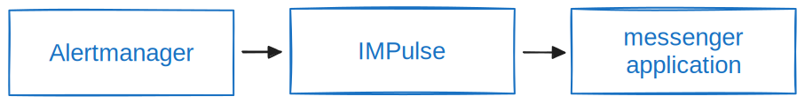
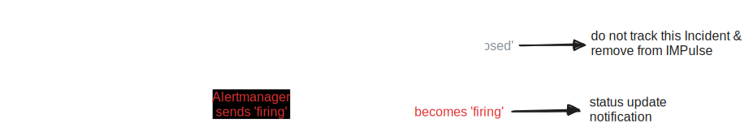

# Concepts

IMPulse installed between Alertmanager and one of [instant messaging apps](apps.md).

It get's alerts from Alertmanager and send it to [instant messaging app](apps.md) channel based on `application` and `route` [configuration](install_and_configure.md#42-impulseyml).

Alertmanager sends alerts with one of two statuses: **firing** and **resolved**. Of course, first status always **firing** when problem occurs. Based on these statuses IMPulse create Incidents.

## Incident

Incident is a message representation of alert with actual status.

### Structure
Starting from [`v1.0.0`](https://github.com/DiTsi/impulse/releases/tag/v1.0.0) incident messages has structure:

Default templates for `status icons`, `header` and `body` are [here](https://github.com/DiTsi/impulse/tree/main/templates).

You can create your own template files based on defaults and set their path in [application.template_files](https://github.com/DiTsi/impulse/blob/main/impulse.yml.slack).

### Statuses and their colors

Unlike of Alertmanager alerts, IMPulse Incidents may have 4 statuses: **firing**, **resolved**, **unknown**, **closed**.

#### firing and resolved

 

Incident change status to **firing** and **resolved** based on Alertmanager's alerts statuses sent to IMPulse.

#### unknown

What is **unknown**. Alertmanager has `repeat_interval` and `group_interval` values which force Alertmanager to sent actual alert status even if it didn't changed. IMPulse has [`timeouts.firing`](https://github.com/DiTsi/impulse/blob/main/impulse.yml.slack) value during which alert status should be updated. And if `repeat_interval` + `group_interval` more than [`timeouts.firing`](https://github.com/DiTsi/impulse/blob/main/impulse.yml.slack) Incident switch to non-actual status named **unknown**.

There are two reasons for this:

- first, IMPulse didn't receive actual status from Alertmanager. May be IMPulse was down, Alertmanager was down or network problems
- second, `repeat_interval`+`group_interval` is less than IMPulse's `timeouts.firing`. Admins should check it

When Incident becomes **unknown** IMPulse send warning message to `application.admin_users`.

#### closed

What is **closed** Incident. As it sounds it is Incident which already didn\`t tracks by IMPulse. There are two ways how it can be closed. First, **resolved** Incident stays in this status for `timeouts.resolved` time. Second, **unknown** Incidents stays in this status for `timeouts.unknown` time.

### Lifecycle

Incident is created with status **firing** and stop tracing after status **closed**. You can see all the options for each status and notification

