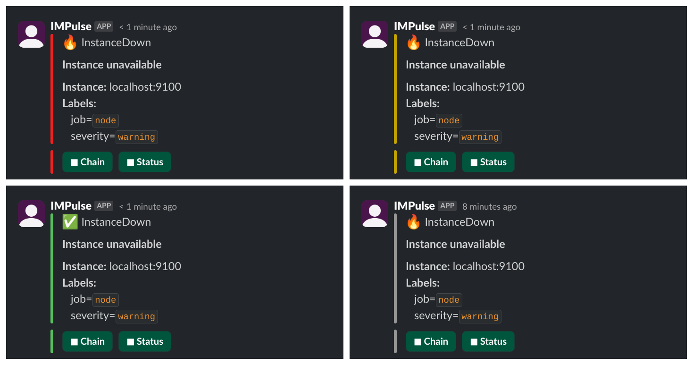

# Overview

## What is IMPulse?

IMPulse - Incident Management Program that handle [Alertmanager's](https://prometheus.io/docs/alerting/latest/alertmanager/) alerts and creates Incidents in [instant messaging apps](apps.md).

If you want to understand how IMPulse works see [Concepts](concepts.md).

<!-- ## Features

IMPulse features are:

- incident management based on Alertmanager alerts
- auto-close zombie incidents
- users / groups mention
- incident status update alerts
- start / pause notification chain
- start / pause status update messages
- webhook for custom notifications (such as [Twilio](https://twilio.com))
- updates notifications -->

## Getting started

See [Installation](installation.md)
